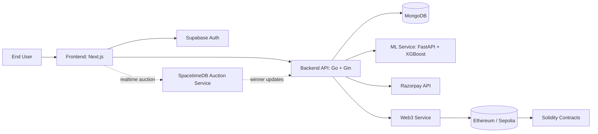

# ChitSetu

ChitSetu is a decentralized chit fund platform that combines modern fintech workflows (KYC, risk scoring, digital payments) with blockchain-backed recording and real-time auction orchestration.

This repo contains:
- A Go backend API (core business logic, auth, funds, payments, persistence, auction)
- A Next.js frontend app (user onboarding, dashboard, fund and payment UX)
- Solidity smart contracts (chit fund and factory contracts)
- A Python ML service (credit-risk and trust score inference)

## Table of Contents
- [Superplane Demonstration](#superplane-demonstration)
- [Project Vision](#project-vision)
- [Primary Use Cases](#primary-use-cases)
- [Architecture Overview](#architecture-overview)
- [Monorepo Structure](#monorepo-structure)
- [Technology Stack](#technology-stack)
- [Environment Variables](#environment-variables)
- [Getting Started (Local Development)](#getting-started-local-development)
- [Service Runbook](#service-runbook)
- [Backend API Overview](#backend-api-overview)
- [Data Model and Indexing](#data-model-and-indexing)
- [Blockchain Layer](#blockchain-layer)
- [ML Risk Scoring Layer](#ml-risk-scoring-layer)
- [End-to-End Flows](#end-to-end-flows)
- [Current Gaps and Roadmap Notes](#current-gaps-and-roadmap-notes)
- [Security and Compliance Notes](#security-and-compliance-notes)
- [Testing and Validation](#testing-and-validation)


## Superplane-demonstration

Google drive link : https://docs.google.com/videos/d/1z8-xmYAc7Tqz1i4cxgaiaumzFqQ25THixbSkvfHacGI/edit?usp=sharing

## Project Vision

Traditional chit funds are community-driven but operationally fragile: trust, tracking, payment consistency, and manual records are difficult at scale. ChitSetu aims to digitize this lifecycle with:

- Structured identity and KYC onboarding
- Risk-aware member participation via ML-generated trust scores
- Transparent periodic contributions with digital payment rails
- Deterministic auction mechanics for winner selection
- Immutable blockchain recording for critical transactions

The design prioritizes correctness and safety for financial workflows.

## Primary Use Cases

1. User onboarding and trust setup
- User signs up/login
- Completes profile and PAN details
- Gets trust score + risk band from ML service

2. Fund lifecycle management
- Organizer creates a fund with members, contribution amount, and duration
- Eligible users apply and organizer approves members
- Contribution obligations are generated per cycle

3. Payment and contribution tracking
- User opens a payment session
- Razorpay order is created and verified via signature
- Contribution status is updated and optionally pushed to blockchain

4. Auction and payout cycle
- Members bid for cycle allocation
- Winner and payout logic executed through auction logic/contract rules
- Events and payout outcomes tracked

## Architecture Overview



## Monorepo Structure

```text
.
├─ contracts/                 # Solidity contracts + Hardhat config/scripts
├─ docs/                      # Documentation (currently mostly empty placeholders)
├─ frontend/                  # Next.js web app
├─ services/
│  ├─ backend/                # Go backend API
│  ├─ ml-service/             # Python FastAPI ML scoring service
│  └─ spacetime-auction/      # SpacetimeDB auction module (scaffold)
├─ scripts/                   # Root scripts (currently empty placeholders)
├─ docker-compose.yml         # MongoDB container for local dev
└─ .env.example               # Environment variable template
```

## Technology Stack

Backend (services/backend)
- Go 1.24
- Gin (HTTP API)
- MongoDB Go driver
- JWT (golang-jwt)
- go-ethereum client
- robfig/cron for background reminder/retry jobs

Frontend (frontend)
- Next.js 15 + React 19 + TypeScript
- Material UI + Emotion
- Framer Motion
- Supabase JS SDK
- TailwindCSS 4

Smart Contracts (contracts)
- Solidity 0.8.20
- Hardhat + Ethers.js
- OpenZeppelin contracts

ML Service (services/ml-service)
- Python + FastAPI + Uvicorn
- XGBoost + scikit-learn + pandas + numpy
- Optional Gemini-assisted synthetic data generation path

Realtime Auction (services/spacetime-auction)
- SpacetimeDB TypeScript reducer/schema scaffold
- Current status: files present but reducer/schema logic not implemented yet

## Environment Variables

Copy and edit:

```bash
cp .env.example .env
```

Core variables (from `.env.example`):

Database
- `MONGO_URI`
- `MONGO_DB_NAME`
- `MONGO_MAX_POOL_SIZE`
- `MONGO_MIN_POOL_SIZE`
- `MONGO_CONNECT_TIMEOUT_MS`

Backend
- `PORT`
- `JWT_SECRET`

Supabase / OAuth
- `SUPABASE_URL`
- `SUPABASE_ANON_KEY`
- `SUPABASE_JWT_SECRET`
- `GOOGLE_CLIENT_ID`
- `GOOGLE_CLIENT_SECRET`
- `AUTH_CALLBACK_URL`

Frontend public vars
- `NEXT_PUBLIC_SUPABASE_URL`
- `NEXT_PUBLIC_SUPABASE_ANON_KEY`
- `NEXT_PUBLIC_AUTH_CALLBACK_URL`
- `NEXT_PUBLIC_API_URL`

ML service
- `ML_SERVICE_URL`

Payments / notifications
- `RAZORPAY_KEY_ID`
- `RAZORPAY_KEY_SECRET`
- `APP_BASE_URL`
- `RESEND_API_KEY`
- `RESEND_FROM_EMAIL`
- `PAYMENT_REMINDER_FALLBACK_EMAIL`

Optional Web3 integration (backend reads these if configured)
- `WEB3_RPC_URL`
- `WEB3_PRIVATE_KEY`
- `CONTRACT_ADDRESS`
- `CONTRACT_ABI_JSON`

## Getting Started (Local Development)

Prerequisites
- Node.js 18+
- Go 1.24+
- Python 3.10+
- Docker Desktop

1. Start MongoDB

```bash
docker-compose up -d
```

2. Start backend

```bash
cd services/backend
go mod download
go run cmd/server/main.go
```

Backend defaults to `http://localhost:8080`.

3. Start ML service

```bash
cd services/ml-service
pip install -r requirements.txt
python -m uvicorn app.main:app --host 0.0.0.0 --port 8000 --reload
```

ML defaults to `http://localhost:8000` and Swagger UI at `/docs`.

4. Start frontend

```bash
cd frontend
npm install
npm run dev
```

Frontend defaults to `http://localhost:3000`.

## Service Runbook

Backend health
- `GET /health`
- `GET /health/db`

Important backend startup behavior
- Loads `.env` from several parent-relative paths
- Validates required auth env vars on boot
- Connects to MongoDB and ensures indexes at startup
- Starts daily reminder cron and blockchain retry cron

ML service quick checks
- `GET /` for status
- `POST /predict` for trust score
- `POST /generate-credit` for PAN/CIBIL simulation
- `POST /generate-history` for synthetic history generation

## Backend API Overview

Auth
- `POST /auth/register`
- `POST /auth/login`
- `POST /auth/refresh`
- `POST /auth/verify` (validate Supabase token + local sync)
- `GET /auth/me`

User and KYC
- `POST /user/profile`
- `POST /user/kyc/verify-pan`
- `POST /user/kyc/fetch-history`
- `POST /user/kyc/run-ml`
- `GET /users/profile`
- `GET /users/risk-score`
- `GET /users/kyc/status`
- `GET /users/me/funds`
- `GET /users/me/contributions`

Funds
- `POST /funds`
- `GET /funds`
- `GET /funds/:id`
- `POST /funds/:id/apply`
- `POST /funds/:id/approve`
- `GET /funds/:id/members`
- `GET /funds/:id/contributions/current`

Payments
- `GET /payments/session/:id`
- `POST /payments/create-order`
- `POST /payments/verify`

Legacy protected route
- `GET /api/chits`

Auth model currently supports two patterns:
- Local email/password JWT flow (`/auth/register/login/refresh`)
- Supabase token verification and user synchronization (`/auth/verify`, `/auth/me` with Supabase middleware)

## Data Model and Indexing

MongoDB is the operational source of truth.

Core collections and index intentions include:
- `users` (unique email, sparse unique PAN path)
- `auth_sessions` (refresh session tracking)
- `user_profiles` (unique by user)
- `funds` (status and creator indexes)
- `fund_members` (unique compound fund+user)
- `contributions` (unique compound fund+user+cycle)
- `payment_sessions`, `payment_orders` (session/order uniqueness and lookups)

The backend initializes indexes programmatically during startup.

## Blockchain Layer

Contracts
- `ChitFund.sol`: member joining, contributions, bid submission, round finalization, payout/dividend distribution
- `ChitFundFactory.sol`: deploys and tracks funds
- `EscrowToken.sol`: token contract in stack

Deployment

```bash
cd contracts
npm install
npx hardhat run scripts/deploy.ts --network sepolia
```

Hardhat network config expects:
- `RPC_URL`
- `PRIVATE_KEY`

Backend web3 integration
- Backend attempts to initialize web3 service at startup
- If not configured, API still runs and logs web3 as disabled
- Payment verification path can enqueue blockchain status and retry confirmation jobs

## ML Risk Scoring Layer

Purpose
- Assign trust score and risk category for user eligibility and risk-aware workflows

Model modes
- Cold-start path: users with limited/no historical credit signals
- History path: users with CIBIL-style/history features

Typical output fields
- `score`
- `risk_band`
- `default_probability`

Backend uses this service during KYC progression and stores results in profile data.

## End-to-End Flows

1. Onboarding + KYC + Trust Score
- User authenticates
- Submits profile and PAN
- Backend triggers PAN/credit simulation + ML scoring
- Frontend displays risk/trust card

2. Fund creation and applications
- Organizer creates fund
- Users apply (requires KYC + credit prerequisites)
- Organizer approves applicants
- Contribution schedule is generated

3. Contribution payment
- User opens session
- Backend creates Razorpay order
- Frontend widget completes checkout
- Backend verifies signature and marks payment
- Optional blockchain record is attempted and tracked

4. Auction lifecycle (target design)
- Bidding in real-time through SpacetimeDB module
- Winner finalized and propagated to backend/contracts
- Current repository has scaffold files; implementation pending

## Current Gaps and Roadmap Notes

The following are currently scaffolded/placeholder in this repository state:
- Root docs (`docs/architecture.md`) are empty
- Root helper scripts (`scripts/start-dev.sh`, `scripts/seed-db.sh`) are empty
- Spacetime auction schema/reducers are empty placeholders
- Some frontend hooks for auction/funds are not yet implemented
- Contract test file currently has no active tests

Recommended near-term priorities
1. Complete SpacetimeDB schema/reducers and backend event integration
2. Add contract and backend integration tests for financial paths
3. Add seeded local data scripts and one-command local startup
4. Expand architecture docs with sequence diagrams and operational runbooks

## Security and Compliance Notes

- Sensitive keys are environment-driven; do not commit secrets
- Payment verification uses HMAC signature checks (Razorpay)
- Auth sessions use refresh token hashing and revocation lifecycle
- KYC and PAN-related paths are treated as sensitive identity data
- For production readiness, prefer strict secret management and audit logging

## Testing and Validation

Frontend

```bash
cd frontend
npm run lint
npm run build
```

Backend

```bash
cd services/backend
go test ./...
```

Contracts

```bash
cd contracts
npx hardhat test
```

ML service

```bash
cd services/ml-service
python -m pytest
```

Note: test coverage in some modules is still incomplete; prioritize payment, fund-state, and auction correctness tests for financial safety.

